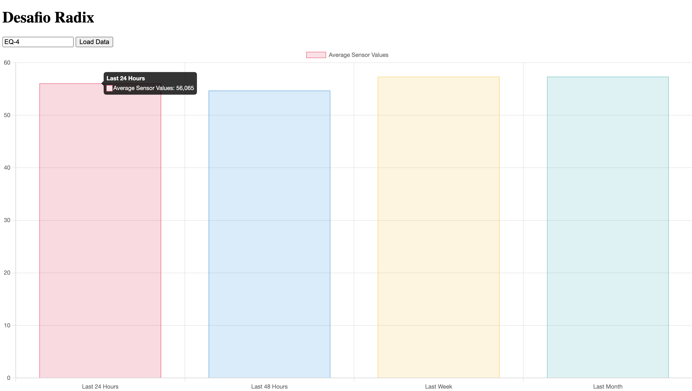

# Desafio Radix

O Desafio Radix é um projeto desenvolvido para lidar com a recepção, armazenamento e análise em tempo real de dados provenientes de sensores instalados em equipamentos de uma planta do setor de óleo e gás. Com a instalação de sensores em mais de 2.000 equipamentos, o objetivo é criar uma infraestrutura capaz de receber dados desses sensores e fornecer insights valiosos para monitoramento e tomada de decisões.

## Funcionalidades Principais

**Recepção e Armazenamento de Dados em Tempo Real:**
Desenvolvimento de uma API com endpoints capazes de receber requisições em tempo real no formato JSON,
contendo informações como o identificador do equipamento, timestamp do evento e valor do sensor. Esses
dados são então armazenados em um banco de dados para posterior análise.

**Gerenciamento de Falhas Técnicas:**
Implementação de um endpoint adicional na API para receber arquivos CSV contendo dados perdidos de sensores que apresentaram falhas técnicas. A API realiza o parsing desses dados e os salva no banco de dados, garantindo a integridade e completude dos registros.

**Análise e Visualização de Dados:**

Criação de uma interface de usuário (UI) que exibe o valor médio de cada sensor nas últimas 24 horas, 48 horas, 1 semana ou 1 mês. A UI apresenta gráficos intuitivos para facilitar a análise e monitoramento dos dados, fornecendo insights valiosos sobre o desempenho dos equipamentos ao longo do tempo. Exemplo:

## Tecnlogias

- Linguagem de Programação: Python
- Framework Web: Flask
- Banco de Dados: SQLite
- Ferramentas de Análise e Visualização: Chart.js

## Instalação

- Clone o projeto no diretório desejado do seu computador
- Instale as dependências usando o comando "pip install -i requirements.txt"
- Acesse o diretório raiz e execute o arquiuvo app.py

## Rotas

### POST - /api/equipment

Esta rota permite adicionar um novo equipamento ao banco de dados.

*Parâmetros:*

- JSON no corpo da solicitação com os seguintes campos:
  - `equipmentId` (string): Identificador único do equipamento.
  - `timestamp` (string): Data e hora do evento no formato 'YYYY-MM-DDTHH:MM:SS.SSS±HH:MM'.
  - `value` (float): Valor do sensor com precisão de duas casas decimais.

*Respostas:*

- **201 Created:** Retorna uma mensagem de sucesso se o equipamento foi adicionado com sucesso.
- **400 Bad Request:** Retorna uma mensagem de erro se os dados fornecidos forem inválidos.
- **500 Internal Server Error:** Retorna uma mensagem de erro se ocorrer um erro interno do servidor.

### POST - api/equipment/upload_csv

Esta rota permite fazer upload de um arquivo CSV contendo dados de equipamentos para serem processados e salvos no banco de dados.

*Parâmetros:*

- Arquivo CSV no corpo da solicitação.

*Respostas:*

- **201 Created:** Retorna uma mensagem de sucesso e uma lista de equipamentos adicionados ou atualizados com sucesso.
- **400 Bad Request:** Retorna uma mensagem de erro se não houver parte de arquivo na solicitação ou se nenhum arquivo for selecionado.
- **500 Internal Server Error:** Retorna uma mensagem de erro se ocorrer um erro interno do servidor durante o processamento do arquivo CSV.

### GET - /api/equipment/home

Esta rota retorna a página inicial da interface do usuário, que lista os identificadores únicos de equipamentos disponíveis no banco de dados.

*Respostas:*

- **200 OK:** Retorna a página inicial com uma lista de identificadores de equipamentos.

---

### Rota: GET /equipment-records

Esta rota retorna os registros de um equipamento específico para análise.

*Parâmetros:*

- `equipment_id` (string): Identificador único do equipamento.

*Respostas:*

- **200 OK:** Retorna uma mensagem de sucesso com os registros do equipamento solicitado e as médias calculadas para diferentes intervalos de tempo.
- **400 Bad Request:** Retorna uma mensagem de erro se nenhum ID de equipamento for fornecido.
- **404 Not Found:** Retorna uma mensagem de erro se não houver registros para o ID de equipamento fornecido.
- **500 Internal Server Error:** Retorna uma mensagem de erro se ocorrer um erro interno do servidor durante a recuperação dos registros.
